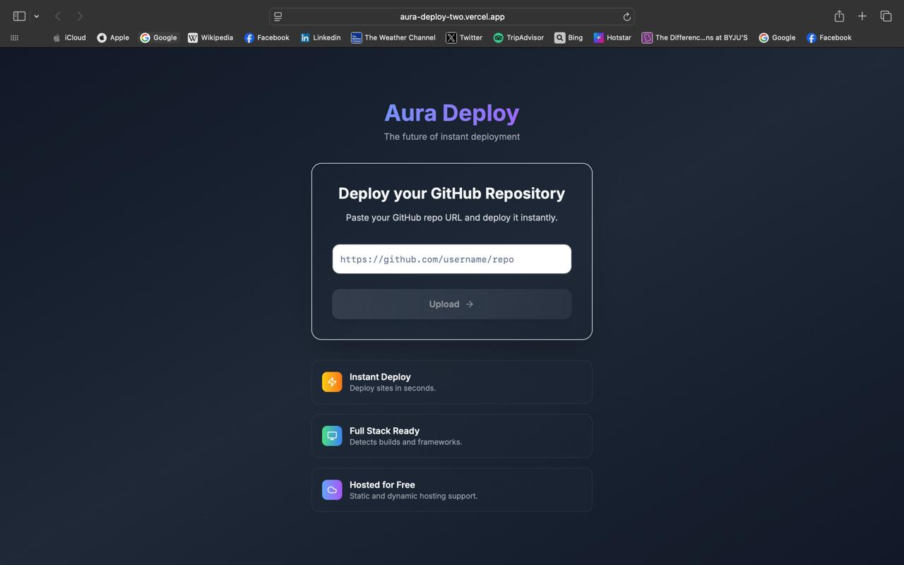

# AuraDeploy

_From Local to Live, in Moments._

🔗 https://aura-deploy-two.vercel.app

## Project Overview

AuraDeploy is a robust, Vercel-inspired platform designed to simplify and automate the deployment of web applications, primarily React projects. It streamlines the entire deployment pipeline, from code upload to live serving, allowing developers to focus on building rather than on complex infrastructure.

## Key Features & Technologies

1. Effortless Deployment: Deploy your GitHub repositories with just a few clicks.

2. Automated Build Process: Automatically fetches your project, runs npm install and npm run build, and prepares it for serving.

3. Scalable Architecture: Designed for high availability and performance with asynchronous processing and support for load balancing.

4. Real-time Status Tracking: Monitor the progress of your deployments with immediate status updates.

## Core Components

1. Upload Service: Handles incoming repository URLs, clones the code, stores it securely, and initiates the deployment workflow.

2. Deployment Service: The workhorse that processes deployment jobs, builds your application, and publishes the static assets.

3. Request Handler / Request Service: Efficiently serves your deployed static websites to end-users with caching mechanisms.

## Supporting Technologies

1. Object Storage (AWS S3 / Cloudflare R2): For persistent and scalable storage of both source code and built static assets.

2. Redis: Crucial for managing deployment queues, tracking real-time deployment statuses, and enabling efficient caching.

3. Node.js & TypeScript: Powering the backend services for robust and type-safe development.

4. Express.js: A fast, unopinionated, minimalist web framework for handling API requests.

5. Simple Git: Facilitates the cloning of GitHub repositories.

6. Async Handling (Promises): For managing the complex asynchronous operations inherent in a deployment pipeline.

7. Scalability Features: Built with an eye towards load balancing and auto-scaling solutions like AWS Fargate or Kubernetes for the deployment service.

## How It Works (Conceptual Flow)

- User Initiates Upload: You provide a GitHub repository URL via the frontend.

- Repository Ingestion: The Upload Service clones your repository, stores the source code in object storage, generates a unique Deployment ID, and enqueues this ID in Redis. The Deployment ID is then returned to you.

- Build & Publish: The Deployment Service constantly listens to the Redis queue. Upon receiving a Deployment ID, it downloads the source code, executes npm install and npm run build to create static assets, uploads these built assets back to object storage, and updates the deployment status in Redis to "deployed."

- Serving Your Application: When a user visits your deployed site (e.g., aura-deploy.com/<Deployment-ID>), the Request Handler extracts the Deployment ID, checks its status in Redis, fetches the static files from object storage, and serves them with appropriate content-type headers.

- Frontend Monitoring: Your frontend UI periodically pings the backend to get the latest deployment status, providing a seamless user experience until the deployment is complete.

## Technical Highlights

1. Unique Identifiers: Every deployment is tracked using UUIDs for clear organization.

2. Efficient File Management: Utilizes directory structures within object storage and local temporary directories.

3. Stream-Based Transfers: Leverages Node.js streams for efficient and memory-friendly file transfers between the application and object storage.

4. Asynchronous & Resilient: The entire architecture is designed to handle multiple deployments concurrently and gracefully recover from potential failures.

## Challenges Faced

- Managing Concurrent Deployments: Ensuring stability and resource allocation when multiple users initiate deployments simultaneously.

- Real-time Status Synchronization: Keeping the frontend consistently updated with accurate deployment statuses from the backend.

- Error Handling in Build Process: Robustly capturing and reporting build errors (e.g., npm run build failures) to the user.

## Future Goals

1. Custom Domains: Allow users to map their own custom domains to deployed applications.

2. Deployment Rollbacks: Implement functionality to revert to previous successful deployments.

3. Build Logs: Provide detailed build logs directly in the UI for debugging purposes.

4. Integration with CI/CD: Explore options for continuous deployment directly from GitHub pushes.

5. Support for More Frameworks: Extend support beyond React to other popular web frameworks (e.g., Vue, Angular, static sites).

MIT License © 2025 Vasvi Garg
